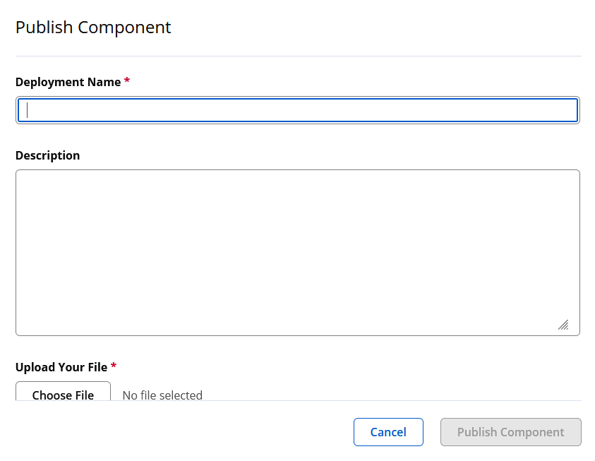
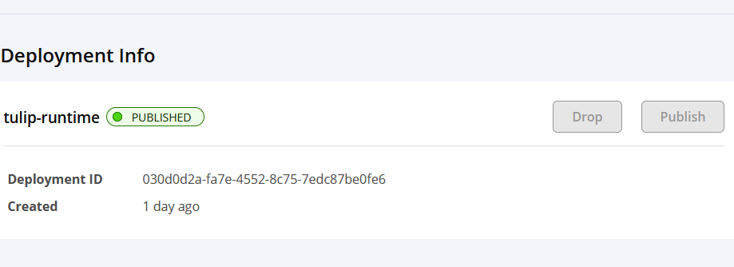

= How Tulip is released
:sectnums:

== Tulip Version

Update the Tulip version in the following files:

. File tulip-runtime/src/main/java/.../api/TulipApi.java
** public static final String VERSION = "**2.0.0**";

. File tulip-runtime/build.gradle.kts
** version = "**2.0.0**"

. File buildMavenArtifacts.cmd
** set version=**2.0.0**

. File buildMavenArtifacts.sh
** export version="**2.0.0**"

Submit the changes to Git and push to Github.

=== [Optionally] Update standalone benchmarks

----
cd tulip-standalone
find . -name '*.*' -print -exec sed -i 's/2\.0\.0/2\.0\.1/g' {} \;
----

== Build Maven Artifacts

Run one of the following scripts one Windows or Linux. It will create a ZIP architeve of signed artifacts to be uploaded to Maven Central.

Linux::

[source,bash]
----
buildMavenCentralArtifacts.sh
----

Windows::

[source,cmd]
----
buildMavenCentralArtifacts.cmd
----

File **tulip-runtime-<version>.zip** fill be created in folder:

* tulip-runtime/build/staging-deploy

== Upload Maven Artifacts

Login to https://central.sonatype.com/ and select *Publish* to update ZIP file **tulip-runtime-<version>.zip** to the Maven Central staging area for validation.

== Publish Maven Artifacts

Once a new release has been uploaded to Maven Central, it can either be dropped or published.  If you drop the release, then you can fix an issue and build a new release and upload it again.

Publishing the release is done by clicking on the **Publish** button. This is an irreversible step.

[appendix]

== Git Commands

=== Tags

* Sync tags from remote to the local repository
+
[source,bash]
----
$ git fetch --prune --tags
----
* Delete a tag in the local repository
+
[source,bash]
----
$ git tag -d v2.0.9
----

=== Alter text of pushed commit

[source,bash]
----
git commit --amend -m "New commit message"
git push --force
----
