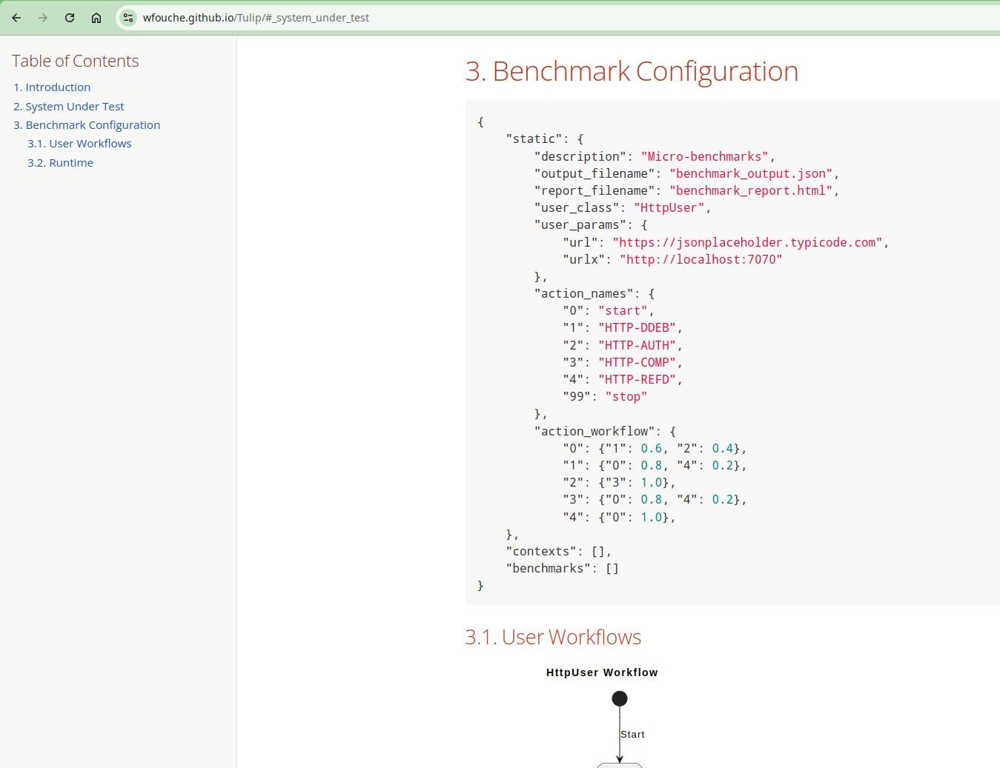
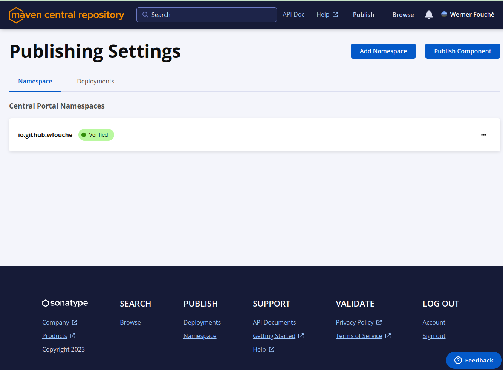
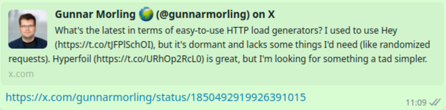

= Tulip: Performance Testing Toolkit
Werner Fouché,  <werner.fouche@gmail.com>
:revealjs_theme: beige
:revealjs_width: 1408
:revealjs_height: 992
:source-highlighter: highlightjs

== When to do Performance Testing?

[.stretch]
image::Screenshot_20241121_094554.png[]

== System Under Test

[plantuml,diag00,svg]
....
@startuml
!include <C4/C4_Container>

LAYOUT_TOP_DOWN()
LAYOUT_WITH_LEGEND()

title Container diagram for Internet Banking System

Person(customer, Customer, "A customer of the bank, with personal bank accounts")

System_Boundary(c1, "Internet Banking") {
    Container(web_app, "Web Application", "Java, Spring MVC", "Delivers the static content and the Internet banking SPA")
    Container(spa, "Single-Page App", "JavaScript, Angular", "Provides all the Internet banking functionality to cutomers via their web browser")
    Container(mobile_app, "Mobile App", "C#, Xamarin", "Provides a limited subset of the Internet banking functionality to customers via their mobile device")
    ContainerDb(database, "Database", "SQL Database", "Stores user registraion information, hased auth credentials, access logs, etc.")
    Container(backend_api, "API Application", "Java, Docker Container", "Provides Internet banking functionality via API")
}

System_Ext(email_system, "E-Mail System", "The internal Microsoft Exchange system")
System_Ext(banking_system, "Mainframe Banking System", "Stores all of the core banking information about customers, accounts, transactions, etc.")

Rel(customer, web_app, "Uses", "HTTPS")
Rel(customer, spa, "Uses", "HTTPS")
Rel(customer, mobile_app, "Uses")

Rel_Neighbor(web_app, spa, "Delivers")
Rel(spa, backend_api, "Uses", "async, JSON/HTTPS")
Rel(mobile_app, backend_api, "Uses", "async, JSON/HTTPS")
Rel_Back_Neighbor(database, backend_api, "Reads from and writes to", "sync, JDBC")

Rel_Back(customer, email_system, "Sends e-mails to")
Rel_Back(email_system, backend_api, "Sends e-mails using", "sync, SMTP")
Rel_Neighbor(backend_api, banking_system, "Uses", "sync/async, XML/HTTPS")
@enduml
....

== Performance Requirements

* Typically created by the Product Manager or Architect(s).
** Number of simultaneous users
** Peak sustained throughput rate, and duration (hours)
** Response times: average, percentile values and maximum
** Cloud/hardware budget

== Performance Testing

* Simulate typical production or special conditions traffic with *virtual users*
* Validate that the application meets *performance requirements*
** Analyze response times
** Discover performance bottlenecks
** Size the underlying infrastructure
* Reduce cloud hosting costs

== Abstract User Class

[.stretch]
[source,java,linenums]
----
public abstract class TulipUser {

   boolean action0() { return true; } 
   boolean action1() { return true; } 
   boolean action2() { return true; } 
   boolean action3() { return true; } 
   boolean action4() { return true; } 
   boolean action5() { return true; } 
   boolean action6() { return true; } 
   boolean action7() { return true; } 
   boolean action8() { return true; } 
   boolean action9() { return true; } 

}
----

=== Abstract User Class 

[.stretch]
[source,java,linenums]
----
public abstract class TulipUser {

   public User(int userId, int threadId)

   boolean onStart()   { return true; } <1>
   boolean action1() { return true; } 
   boolean action2() { return true; } 
   boolean action3() { return true; } 
   boolean action4() { return true; } 
   boolean action5() { return true; } 
   boolean action6() { return true; } 
   boolean action7() { return true; } 
   boolean action8() { return true; } 
   boolean onStop()    { return true; } <2>

}
----
<1> Initialize or restore object state
<2> (Optionally) Save object state

=== Abstract User Class 

[.stretch]
[source,java,linenums]
----
open class TulipUser(val userId: Int, val threadId: Int) {

    private val map = arrayOf(
        ::onStart,
        ::action1,
        ...
        ::action98,
        ::onStop
    )

    open fun onStart(): Boolean = false

    open fun action1(): Boolean = false
    open fun action2(): Boolean = false
    ...
    open fun action96(): Boolean = false
    open fun action97(): Boolean = false
    open fun action98(): Boolean = false

    open fun onStop(): Boolean = false

    open fun processAction(actionId: Int): Boolean {
        return try {
            map[actionId]()
        } catch (e: Exception) {
            Console.put(
               "actionId: ${actionId}, userId: ${userId}, threadId: ${threadId}, " +
               e.toString())
            false
        }
    }
}
----

=== Concrete User Class 

[.stretch]
[source,java,linenums]
----
public class HttpUser extends TulipUser {

   public HttpUser(int userId, int threadId) {
      super(userId, threadId);
   }

   public boolean onStart() {
      ...
   }

   public boolean action1() {
      ...
   }
   public boolean action2() {
      ...
   }
   ...
   public boolean onStop() {
      ...
   }
}
----

=== Concrete User Class 

[.stretch]
[source,java,linenums]
----
public class HtmlUser extends TulipUser {

   ...

}

public class HttpUser extends TulipUser {

   ...

}

public class JdbcUser extends TulipUser {

   ...

}

public class KafkaUser extends TulipUser {

   ...

}

public class RedisUser extends TulipUser {

   ...

}
----

== Tulip User Actions Scheduler

Stateless Interactions - randomized::
* Actions can be executed in any order

Stateful Interactions - workflows::
* Actions have to be executed in a specific order (shared state)

== [A] Stateless Interactions

* Actions can be executed in any order
* Execution order is randomized based on specified distribution / weight
+
[source,json,linenums]
----
{
   "actions": [
        { "id": 1, "weight": 25},
        { "id": 2, "weight": 75}
    ]
}
----

* JSONPlaceholder comes with a set of 6 common resources:

** /posts	100 posts
** /comments	500 comments
** ...

=== [A] Stateless Interactions

* Execution order is sequential, if distribution / weight not specified
+
[source,json,linenums]
----
{
   "actions": [
        { "id": 1},
        { "id": 2}
    ]
}
----

== [B] Stateful Interactions

[.stretch]
[plantuml,diag01,svg]
....
@startuml

title rest-api1

    state "-" as IP
    state "Action 1" as A0
    state "Action 2" as A1
    state "Action 3" as TST
    state "Action 4" as D

    IP --> A0: 0.6
    A0 --> IP: 0.8
    A0 --> D: 0.2
    IP --> A1: 0.4
    A1 --> TST: 1.0
    TST --> IP: 0.8
    TST --> D: 0.2
    D --> IP: 1.0

@enduml
....

[.columns]
=== [B] Stateful Interactions

[.column]
[plantuml,diag02,svg]
....
@startuml

title rest-api1

    state "-" as IP
    state "Action 1" as A0
    state "Action 2" as A1
    state "Action 3" as TST
    state "Action 4" as D

    IP --> A0: 0.6
    A0 --> IP: 0.8
    A0 --> D: 0.2
    IP --> A1: 0.4
    A1 --> TST: 1.0
    TST --> IP: 0.8
    TST --> D: 0.2
    D --> IP: 1.0

@enduml
....

[.column]
[source,json,linenums]
----
{
    "workflows": {
        "rest-api1": {
            "-": {"1": 0.6, "2": 0.4},
            "1": {"-": 0.8, "4": 0.2},
            "2": {"3": 1.0},
            "3": {"-": 0.8, "4": 0.2},
            "4": {"-": 1.0}
        }
    }
}
----

== Benchmark Config

[.stretch]
[source,json,linenums]
----
{
    "actions": {},
    "contexts": [],
    "benchmarks": [],
    "workflows": []
}
----

=== Benchmark Config

[.stretch]
[source,json,linenums]
----
{
    "actions": {
        "description": "Micro-benchmarks",
        "output_filename": "benchmark_output.json",
        "report_filename": "benchmark_report.html",
        "user_class": "HttpUser",
        "user_params": {
            "url": "https://jsonplaceholder.typicode.com",
            "urlx": "http://localhost:7070"
        },
        "action_names": {
            "0": "start",
            "1": "HTTP-DDEB",
            "2": "HTTP-AUTH",
            "3": "HTTP-COMP",
            "4": "HTTP-REFD",
            "99": "stop"
        }
    }
    "contexts": [],
    "benchmarks": [],
    "workflows": []
}
----

=== Benchmark Config

[.stretch]
[source,json,linenums]
----
{
    "actions": {},
    "contexts": [
        {
            "name": "Context-1",
            "enabled": true,
            "num_users": 16,
            "num_threads": 2
        },
        {
            "name": "Context-2",
            "enabled": false,
            "num_users": 32,
            "num_threads": 4
        }
    ],
    "benchmarks": [],
    "workflows": []
}
----

=== Benchmark Config

[.stretch]
[source,json,linenums]
----
{
    "actions": {},
    "contexts": [],
    "benchmarks": [
        {
            "name": "Init", "enabled": true,
            "actions": [ { "id": 0 } ]
            },
        },
        {
            "name": "Fixed TPS-a", "enabled": true,
            "time": {
                "prewarmup_duration": 15,
                "warmup_duration": 15,
                "benchmark_duration": 30,
                "benchmark_repeat_count": 4
            },
            "throughput_rate": 100.0,
            "worker_thread_qsize": 0,
            "workflow": "rest-api1"
        },
        {
            "name": "Shutdown", "enabled": true,
            "actions": [ { "id": 99 } ]
            },
        },
    ],
    "workflows": []
}
----

=== Benchmark Config

[.stretch]
[source,json,linenums]
----
{
    "actions": {},
    "contexts": [],
    "benchmarks": [
        {
            "name": "Init", "enabled": true,
            "actions": [ { "id": 0 } ]
            },
        },
        {
            "name": "Fixed TPS-a", "enabled": true,
            "time": {
                "prewarmup_duration": 15,
                "warmup_duration": 15,
                "benchmark_duration": 30,
                "benchmark_repeat_count": 4
            },
            "throughput_rate": 100.0,
            "worker_thread_qsize": 0,
            "actions": [
                { "id": 1, "weight": 25},
                { "id": 2, "weight": 75}
            ]
        },
        {
            "name": "Shutdown", "enabled": true,
            "actions": [ { "id": 99 } ]
            },
        },
    ],
    "workflows": []
}
----

=== Benchmark Config

[.stretch]
[source,json,linenums]
----
{
    "actions": {},
    "contexts": [],
    "benchmarks": [
    "workflows": {
        "rest-api1": {
            "-": {"1": 0.6, "2": 0.4},
            "1": {"-": 0.8, "4": 0.2},
            "2": {"3": 1.0},
            "3": {"-": 0.8, "4": 0.2},
            "4": {"-": 1.0}
        }
    }
}
----

// https://plantuml.com/color

== Benchmark Execution

[.stretch]
[plantuml,diag03,svg]
----
@startuml
split
   -[hidden]->
   #greenyellow:CONFIG.JSON;
split again
   -[hidden]->
   #beige:APP;
split again
   -[hidden]->
   #beige:USER.JAR;
split again
   -[hidden]->
   #azure:TULIP-RUNTIME.JAR;
end split
:EXECUTE;
#greenyellow:OUTPUT.JSON;
#cadetblue:REPORT.HTML;
@enduml
----

== Tulip Threads / User Objects

[.stretch]
[plantuml,diag04,svg]
----
@startmindmap
* Main-Thread
** Thread-0
*** U0
*** U1
** Thread-1
*** U2
*** U3
** Thread-2
*** U4
*** U5
** Thread-3
*** U6
*** U7
@endmindmap
----

== Benchmark App

.App.java
[source,bash,linenums]
----
///usr/bin/env jbang "$0" "$@" ; exit $?
//DEPS io.github.wfouche.tulip:tulip-runtime:0.1.0-SNAPSHOT
//SOURCES HttpUser.java

import io.github.wfouche.tulip.api.TulipApi;
import io.github.wfouche.tulip.api.TulipUserFactory;

public class App {
    public static void main(String[] args) {
        TulipApi.runTulip("./benchmark_config.jsonc",
            new TulipUserFactory());
    }
}
----

.run_bench.sh
[source,bash,linenums]
----
#!/bin/bash
export JBANG_JAVA_OPTIONS="-server -Xmx512m -XX:+UseZGC -XX:+ZGenerational"
jbang run App.java
echo ""
w3m -dump -cols 200 benchmark_report.html
----

=== Benchmark App

[.stretch]
image::Screenshot_20241121_122023.png[]

== Benchmark Report - Console

[.stretch]
image::Screenshot_20241121_115838.png[]

== Benchmark Report - HTML

[.stretch]
image::Screenshot_20241121_120824.png[]

== Benchmark Output - JSON

[.stretch]
image::Screenshot_20241121_143033.png[]

== Performance Regression Testing

Tulip::
* Tulip is used to performance test itself
** ArrayBlockingQueue vs LinkedBlockingQueue
** GC settings to minimize maximum latency
* New version of Java, faster or slower
* Ensures that results analysis is accurate

Applications::
* JDBC, OpenAPI, RabbitMQ, Redis, Front-end-for-Backend, ...
* End-to-end performance benchmark suite

== User Documentation

[.stretch]

== Maven Central

Maven::
+
[source,xml]
----
<dependency>
    <groupId>io.github.wfouche.tulip</groupId>
    <artifactId>tulip-runtime</artifactId>
    <version>0.1.0</version>
</dependency>
----

Gradle::
+
[source,toml]
----
implementation("io.github.wfouche.tulip:tulip-runtime:0.1.0")
----

JBang::
+
[source,java]
----
//usr/bin/env jbang "$0" "$@" ; exit $?
//DEPS io.github.wfouche.tulip:tulip-runtime:0.1.0
//SOURCES HttpUser.java

import io.github.wfouche.tulip.api.TulipApi;
import io.github.wfouche.tulip.api.TulipUserFactory;

public class App {

    public static void main(String[] args) {
        TulipApi.runTulip("./benchmark_config.jsonc", new TulipUserFactory());
    }

}
----

== Maven Central

[.stretch]

== Performance Testing Programs

Apache JMeter (Java)::
* https://jmeter.apache.org
Gatling (Scala)::
* https://gatling.io
Hyperfoil (Java, Vert.x)::
* https://hyperfoil.io
Locust (Python)::
* https://locust.io
Tulip (Kotlin with a Java API)::
* https://wfouche.github.io/Tulip
* https://github.com/wfouche/Tulip.git

== Looking for something simpler ...

https://x.com/gunnarmorling/status/1850492919926391015

== &nbsp;

[T]he::
[U]ltimate::
[L]oad::
[I]njection::
[P]rogram::

&nbsp;

== Enterprise Software Deployment

[plantuml,diag05,svg]
....
@startuml
!include <C4/C4_Container>

LAYOUT_TOP_DOWN()
LAYOUT_WITH_LEGEND()

title Container diagram for Internet Banking System

Person(customer, Customer, "A customer of the bank, with personal bank accounts")

System_Boundary(c1, "Internet Banking") {
    Container(web_app, "Web Application", "Java, Spring MVC", "Delivers the static content and the Internet banking SPA")
    Container(spa, "Single-Page App", "JavaScript, Angular", "Provides all the Internet banking functionality to cutomers via their web browser")
    Container(mobile_app, "Mobile App", "C#, Xamarin", "Provides a limited subset of the Internet banking functionality to customers via their mobile device")
    ContainerDb(database, "Database", "SQL Database", "Stores user registraion information, hased auth credentials, access logs, etc.")
    Container(backend_api, "API Application", "Java, Docker Container", "Provides Internet banking functionality via API")
}

System_Ext(email_system, "E-Mail System", "The internal Microsoft Exchange system")
System_Ext(banking_system, "Mainframe Banking System", "Stores all of the core banking information about customers, accounts, transactions, etc.")

Rel(customer, web_app, "Uses", "HTTPS")
Rel(customer, spa, "Uses", "HTTPS")
Rel(customer, mobile_app, "Uses")

Rel_Neighbor(web_app, spa, "Delivers")
Rel(spa, backend_api, "Uses", "async, JSON/HTTPS")
Rel(mobile_app, backend_api, "Uses", "async, JSON/HTTPS")
Rel_Back_Neighbor(database, backend_api, "Reads from and writes to", "sync, JDBC")

Rel_Back(customer, email_system, "Sends e-mails to")
Rel_Back(email_system, backend_api, "Sends e-mails using", "sync, SMTP")
Rel_Neighbor(backend_api, banking_system, "Uses", "sync/async, XML/HTTPS")
@enduml
....
